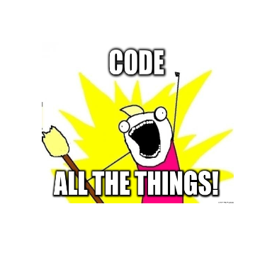
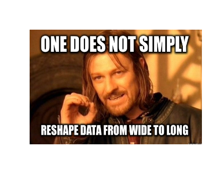
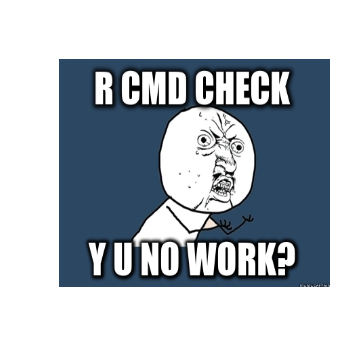
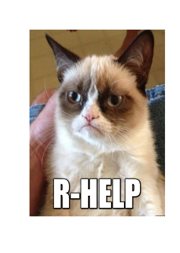

# Meme Generation in R

[](https://travis-ci.org/leeper/meme)

According to [Wikipedia](http://en.wikipedia.org/wiki/Internet_meme):

>An Internet meme (/'mi?m/ meem) is an activity, concept, catchphrase or piece of media which spreads, often as mimicry, from person to person via the Internet.

**meme** is an R package that connects with several online image generators to create internet memes, which can then be loaded into R, plotted, and saved locally.

## Installation ##

At some point **meme** will be [available on CRAN](http://cran.r-project.org/web/packages/meme/index.html) and installed from within R from your favorite CRAN mirror:

```
install.packages("meme")
```

The latest development version, available here, can be installed directly using Hadley Wickham's [devtools](http://cran.r-project.org/web/packages/devtools/index.html) package:

```
if(!require("devtools")) install.packages("devtools")
library("devtools")
install_github("leeper/meme")
```

## Examples ##

Here are some simple examples using the package and the default [memecaptain](http://memecaptain.com/) generator. To get started, you can grab some image templates from one of the meme generator sites. We'll use memecaptain because it doesn't require a username and password.


```r
library("meme")
templates <- get_templates("memecaptain")
```

You can use the `plot.meme_template` method to plot all templates from a given site to help you figure out which one you want to use. Here's some code to do it:

```
par( mfrow = n2mfrow(length(templates)), mar=rep(0,4), mgp=rep(0,3))
invisible(lapply(templates, plot))
```

Here are some example memes. These could probably be better, so pull requests are welcome!


```r
plot(allthethings <- create_meme(templates[[2]], "Code", "all the things!"))
```

 


```r
plot(simply <- create_meme(templates[[10]], "One does not simply", "reshape data from wide to long"))
```

 


```r
plot(yuno <- create_meme(templates[[55]], "R CMD check", "y u no work?"))
```

 


```r
u <- "http://img4.wikia.nocookie.net/__cb20131009153844/villains/images/f/f6/Grumpy_Cat.jpg"
plot(grumpy <- create_meme(u, "", "R-help"))
```

```
## 'template' is not of class 'meme_template'. Template assumed to be an image URL and meme will be generated with site 'memecaptain'.
```

 

